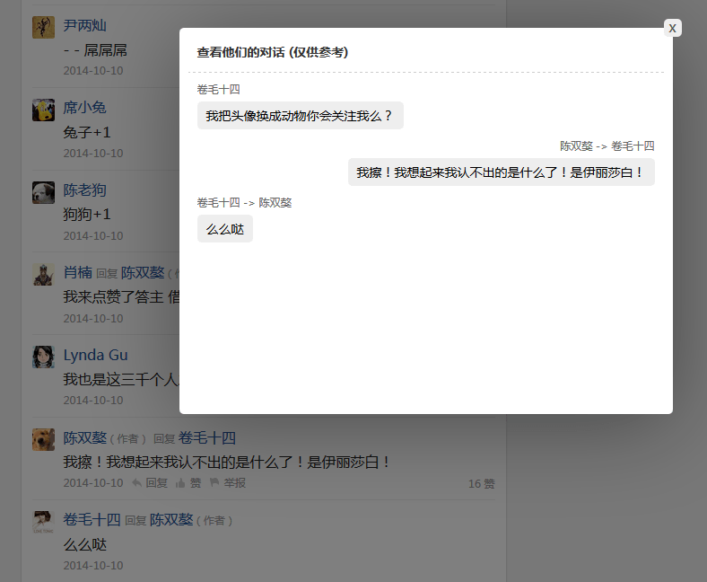
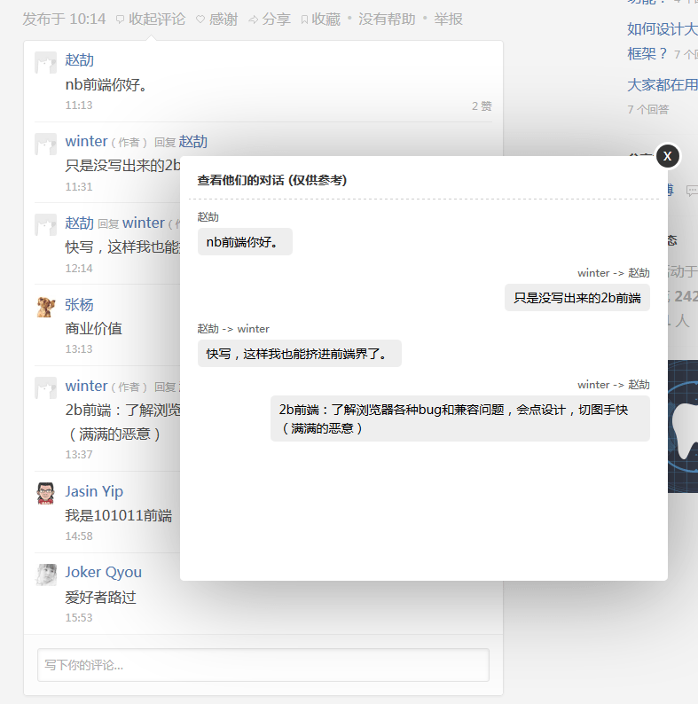

#better-zhihu
让 zhihu 更好的浏览

##缘由
[知乎](http://www.zhihu.com/)，是我经常上的一个网站，蛮有意思的（但大家千万别沉迷 XD）。
不过在展示或者体验上面，我个人有点不太满意，所以根据自己的喜好，创建了油猴代码。

##说明
1. Firefox 32.0.1
1. Greasemonkey 2.2

##修改了哪些？
1. 加宽了浏览区域，变成 1000px

1. `background-color: #f1f1f1;` 
    修改背景色，使用灰色背景，长时间浏览，眼睛会舒服些

1. `font-size: 15px; font-family: "microsoft yahei";` 
    使用 大字体 和 微软雅黑 搭配。再也不用忍受12px宋体了（虽然可以使用浏览器缩放工具，但宋体大于14px 就很难看）

1. **重点**来了，可以查看A对B回复的上下文（测试版）先看截图吧
    
    
    这有点类似新浪微博，我比较喜欢这个功能。当回复多时，想找到某2个人的对话信息，如大海捞针。但可惜只能是测试版本，因为目前只根据zhihu的html源码，我还是无法准确判断，两个人互相交流的数据。
    我稍微解释一下：比如 楼主对麻子说“你好帅”，楼主又对王二说“你也好帅”。这时来了个张三回复楼主说“我也很帅的，么么哒~”。这个时候，就不知道，张三回复楼主是根据麻子的那条回复的，还是王二的那条回复的？！这只有zhihu官方修改代码，带点信息（ID什么的），才知道了。
    
1. 又一个**重点**  （v1.4 更新）  
    知乎的评论，还是“一条筋” ~
 
	目前还好，当滚动到评论区域时，上面还多了个 “收起评论”，可以随时收起。  
	以前可是没有的！可以想象当评论很多的时候，想收起是多么的难。

    但还是不舒服。当加载了100+评论时（现在知乎的用户数量上来了，超长的评论多的是），真的简直就是灾难！评论长条，插入在文章与文章之间！
    
	如果你想根据某个评论和答主内容进行对比，那够你受的。或者，你想内容和评论一起看的时候，更是不可能。:scream:

	所以：
	
	文章来源：http://www.zhihu.com/question/26598476
	
    
	当答主评论超过15条（可配置），点击 “显示全部评论” ，评论会移到右侧，固定并且高度自适应。
	
	大家可以注意到，上面截图的例子，就有一个用户（Roger Chen）的评论：你第二段的描述我就瞬间醉了，真爱无价。  
	“第二段”？ 优势是不是很明显？~~ :grin: :100:



1. 未完待续，体验或者代码方面会继续优化什么的~
    
##Changelog

#### v1.4

1. 还是让鲜艳的顶部栏一直存在吧。时显时隐，好像更不习惯~ :no_mouth:
1. body字体改为15px（稍微缩小一点点)，评论字体缩小 
1. 添加了： 当评论数目很多的时候（大于15个），就会把评论换一种更舒服的方式显示
#### v1.3
1. 知乎的评论允许 p标签（今天才发现），果断修改弹框内容标签为div

#### v1.2
1. 修复 弹框内容涉及到@人名，鼠标移动上去 知乎名片在弹框下面的bug

#### v1.1
1. 对话弹框垂直居中
1. 修改了弹框的背景为白色，0.2的透明度。**这样更自然，免得色彩过渡过程中闪眼** 
1. 点周边遮罩层也是可以关闭对话弹框